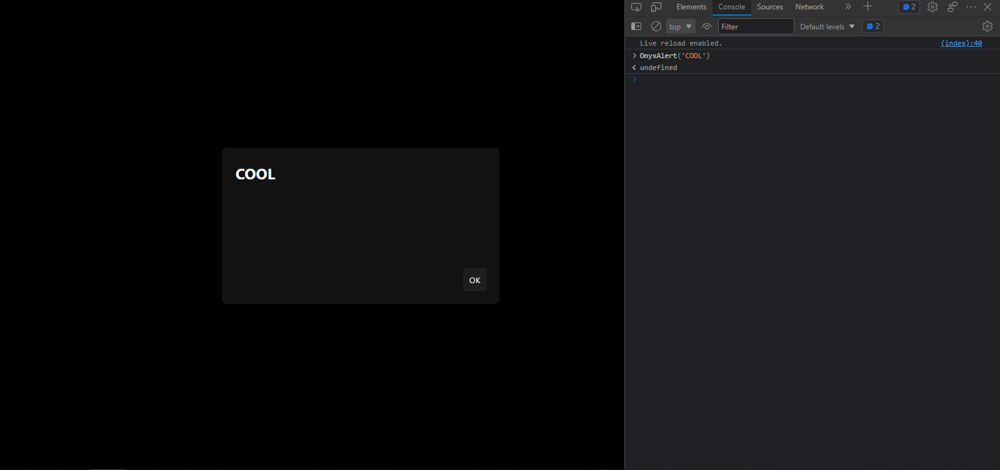
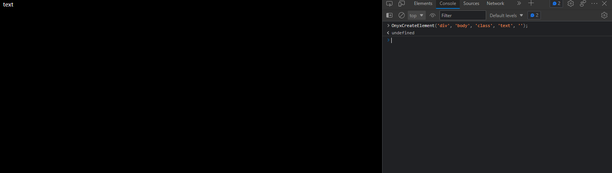
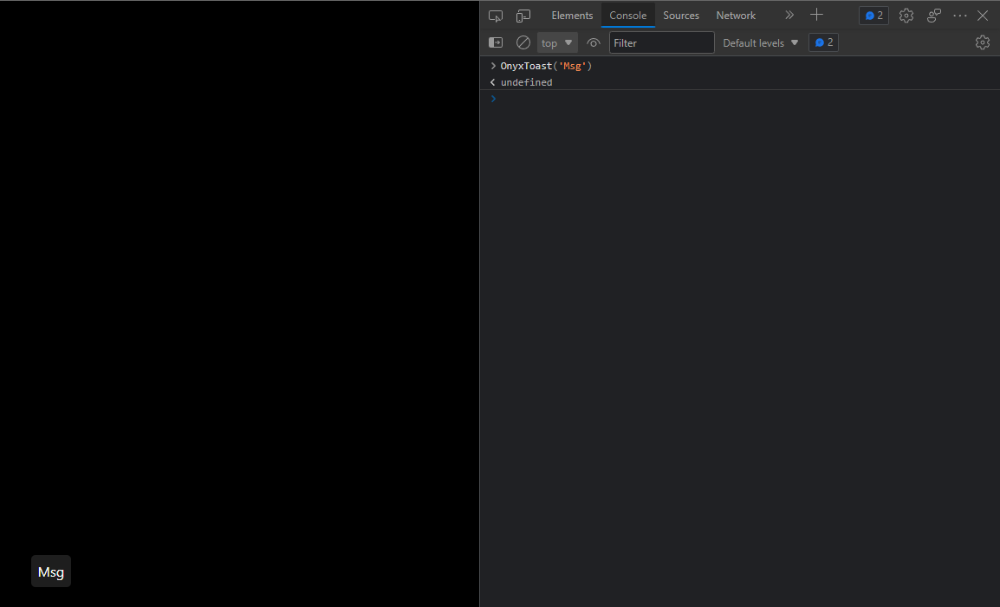
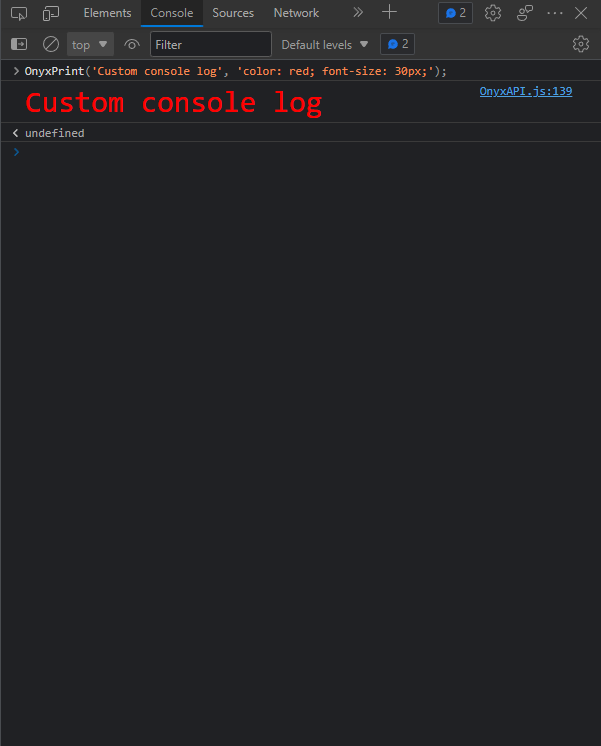

# Onyx Library (v1.7)

Onyx Library will not get updated again for some reason.

A JavaScript library allows the user to use more function. But there is a <a href="https://github.com/YSSF8/Xorio-Library">replacement</a> for it

### How to download and import:
* Download **Onyx.min.js**.
* Put it in the folder where your HTML is.
* Copy the code bellow.
```html
<script src="./Onyx.min.js" type="text/javascript"></script>
```
* Paste the code at the end of the HTML, before the end of **body**.

### How to use:
#### OnyxAlert
```javascript
OnyxAlert('text');
```
#### OnyxPrompt
```javascript
OnyxPrompt('text', 'value of text input');
```
#### OnyxConfirm
```javascript
OnyxConfirm('text');
```
#### OnyxCreateElement
```javascript
OnyxCreateElement('tag', 'parent', 'class', 'text', 'placeholder (if the tag is input tag)');
```
#### OnyxPrint (<a href="#console-messages">Replaced</a>)
```javascript
OnyxPrint('Text to view in the console', 'CSS Style');
```
#### OnyxToast
```javascript
OnyxToast('text');
```
#### OnyxNotice
```javascript
OnyxNotice('text');
```
#### OnyxSysNotif
```javascript
OnyxSysNotif('text', 'content');
```
#### OnyxFollowPointer
```javascript
OnyxFollowPointer('element, .class, #id');
```
#### Console messages
```javascript
// Normale message box
log('Message', 'CSS style');

// Warning message
wrn('Message');

// Error message
err('Message')
```
#### Randomizers
```javascript
// Random letter
OnyxLtrRandom('element, .class, or #id');

// Random number
OnyxNumRandom('element, .class, or #id');
```
#### Counter
```javascript
OnyxCount('element, .class, or #id');
```

### Screenshots:




